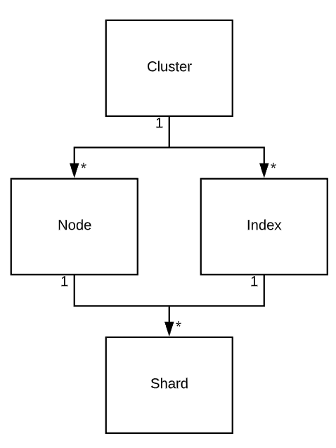

# Introduce Elasticsearch ( ES )

1. What is ES
ES is a management framework for running distributed installations of Apache Lucene, a Java-based search engine. 
Lucene is what actually holds the data and does all the indexing and searching. ES sits on top of this and allows you to run 
potentially many thousands of lucene instances in parallel.

The highest level unit of ES is the cluster. A cluster is a collection of ES nodes and indices.

Nodes are instances of ES. There are different Types of node. The two most interesting of which are the Data Node and 
the Master-eligible Node. A single node can be of multiple types at the same time. Data nodes run all data operations. 
That is storing, indexing and searching of data. Master -eligible nodes vote for a master that runs the cluster and 
index management.

Indices are the high-level abstraction of your data. Indices do not hold data themselves.They are just another abstraction for the 
thing that actually holds data. Any action you do on data such as INSERTS, DELETES, 
indexing and searching run against an Index. Indices can belong to exactly one cluster and are comprised of Shards.

Shards are instances of Apache Lucene. A shard can hold many Documents. Shards are what does the actual data storage, indexing 
and searching. A shard belongs to exactly one node and index. There are two types of shards: primary and replica.
These are mostly the exact same. They hold the same data, and searches run against all shards in parallel. Of all the shards
that hold the same data, one is the primary shard. This is the only shard that can accept indexing requests.
Should the node that the primary shard resides on die, a replica shard will take over and become the primary. Then, ES 
will create a new replica shard and copy the data over.

At the end of the day, we end up with something like this:



2. A more in-depth look at Elasticsearch
Quorum: Nodes vote on who should lead them, the master. The master runs a lot of cluster-management processes and has the last say in many matters

Master-eligible are all nodes that have this in their configuration:
```
node.master: true
```

On cluster start or when the master leaves the cluster, all master-eligible nodes start an election for the new master. For this to work, you need to have 2n+1 master-eligible nodes.with two nodes receiving 50% of the votes. This is a split brain scenario and will lead to the loss of all data in one of the two partitions. So don’t have this happen. You need 2n+1 master-eligible nodes.

How nodes join the cluster: 
Seed Hosts

### Credit: https://facinating.tech/2020/02/22/in-depth-guide-to-running-elasticsearch-in-production/

- Good read for optimize : https://octoperf.com/blog/2018/09/21/optimizing-elasticsearch/


